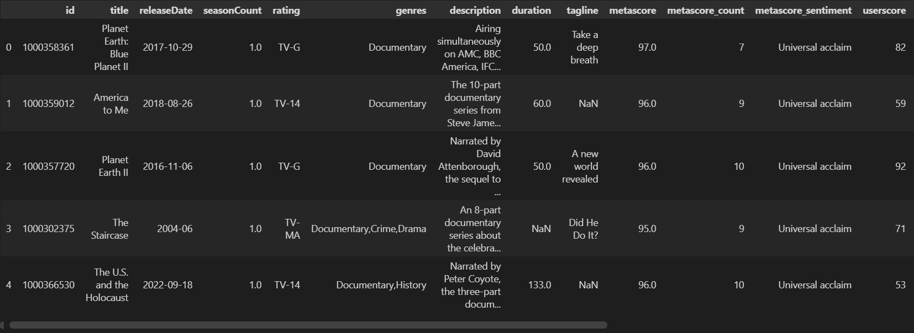
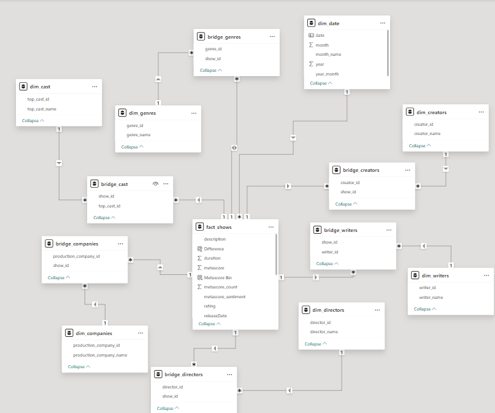
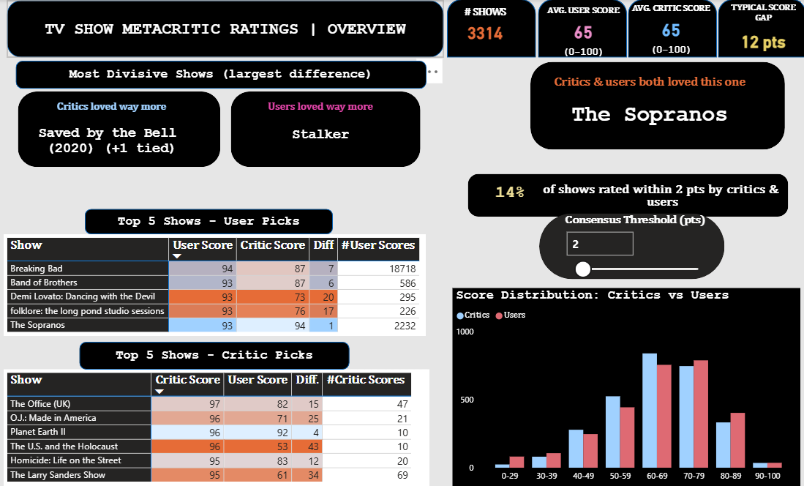
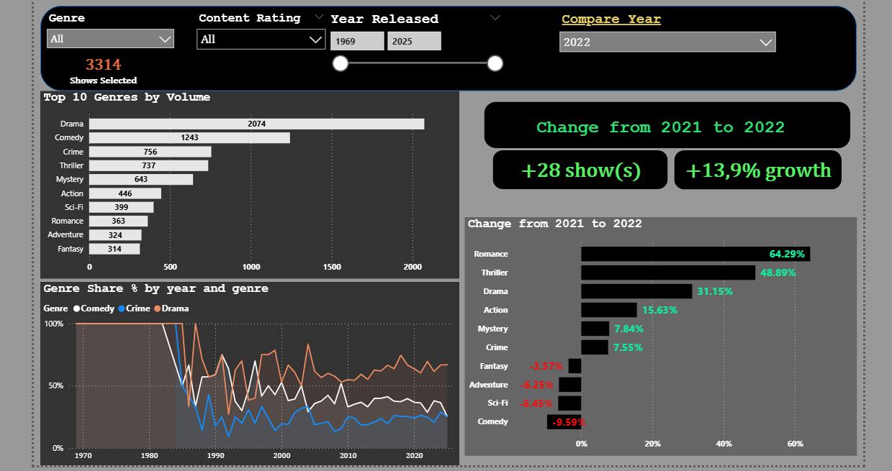
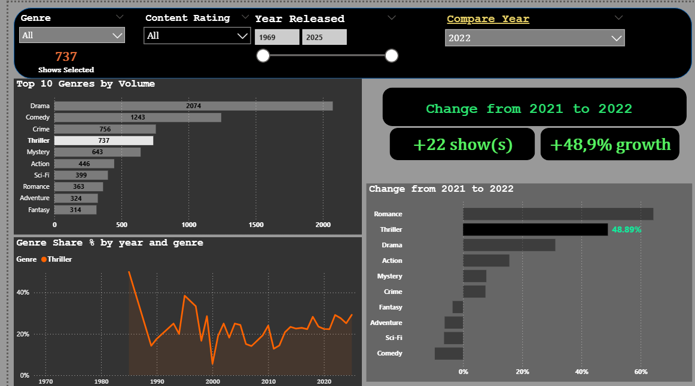

# Metacritic TV Shows Analysis

>  **Project in Progress**

## Goal

Analyze TV show ratings from Metacritic to explore patterns in critic vs audience scores, genre performance, and trends over time. Final output is an interactive Power BI dashboard.

---

## Data

**Source:** [Metacritic TV Shows Dataset](https://www.kaggle.com/datasets/mohamedasak/metacritic-tv-shows-dataset) (Kaggle)

~3,300 TV shows spanning 1969–2025 with metadata including scores, genres, cast, writers, directors, and production companies.

### Raw Data




### Cleaning Summary

- Removed records with no valid score data
- Handled missing values with context-appropriate placeholders
- Standardized date formats (4 different formats → unified)
- Validated select fields via OMDB API

 See: `notebooks/01_data_cleaning.ipynb`

---

## Data Model

Normalized flat dataset into star schema for Power BI:

- **1 Fact table:** Shows
- **6 Dimension tables:** Genres, Cast, Writers, Directors, Companies, Date
- **5 Bridge tables:** For many-to-many relationships



 See: `notebooks/02_data_normalization.ipynb`

---

## Dashboard Preview







---

## Project Structure

```
├── data/
│   ├── raw/
│   └── power_bi_data/
├── notebooks/
│   ├── 01_data_cleaning.ipynb
│   └── 02_data_normalization.ipynb
├── images/
└── README.md
```

---

## Tools

- Python (pandas)
- OMDB API
- Power BI
