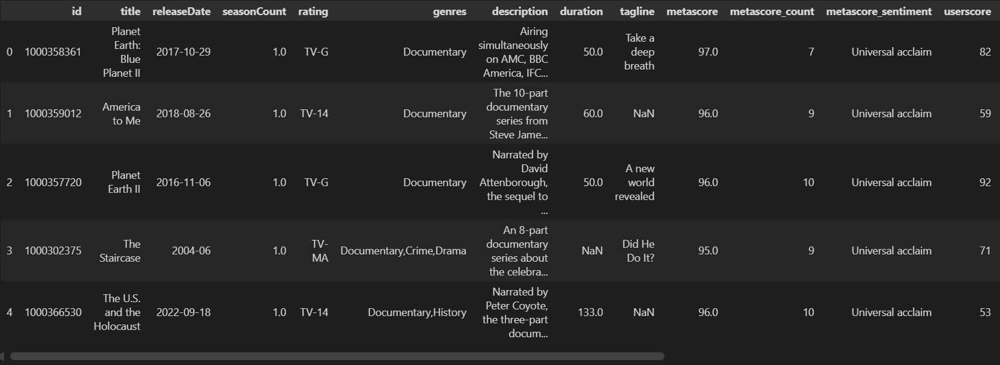
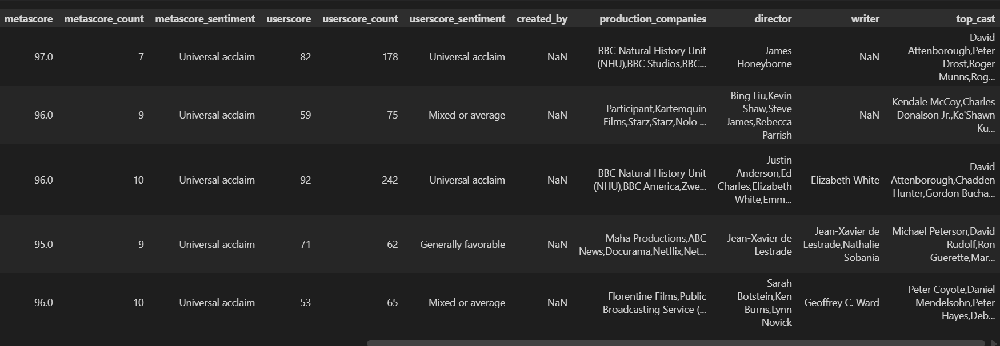
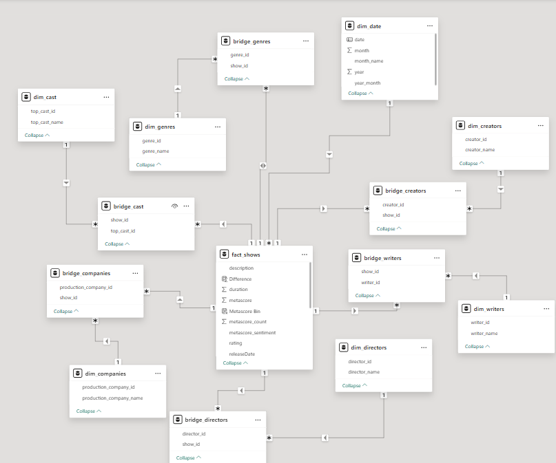
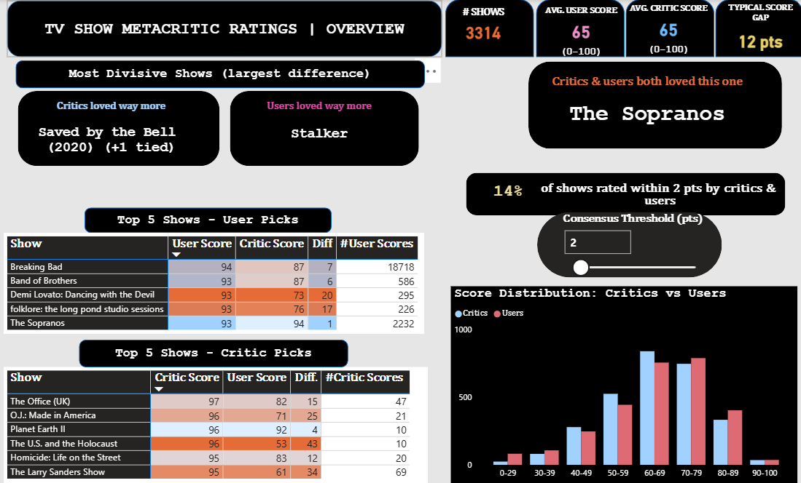
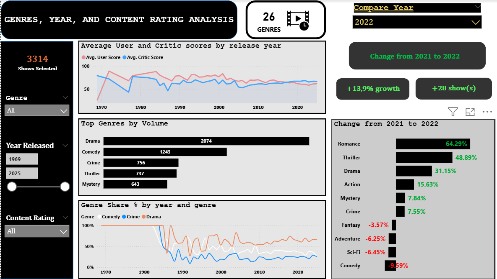

# Metacritic TV Shows Analysis

>  **Project in Progress**

## Goal

Analyze TV show ratings from Metacritic to explore patterns in critic vs audience scores, genre performance, industry talent perfomance by audience and critic scores, and trends over time. Final output is an interactive Power BI dashboard.

---

## Data

**Source:** [Metacritic TV Shows Dataset](https://www.kaggle.com/datasets/mohamedasak/metacritic-tv-shows-dataset) (Kaggle)

~3,300 TV shows spanning 1969–2025 with metadata including scores, genres, cast, writers, directors, and production companies.

### Raw Data



Continued..


### Cleaning Summary

- Removed records with no valid score data
- Handled missing values with context-appropriate placeholders
- Standardized date formats (4 different formats to unified format)
- Validated select fields via OMDB API

 See: `notebooks/01_data_cleaning.ipynb`

---

## Data Model

Normalised flat dataset into star schema for Power BI:

- **1 Fact table:** Shows
- **6 Dimension tables:** Genres, Cast, Writers, Directors, Companies, Date
- **5 Bridge tables:** For many-to-many relationships



 See: `notebooks/02_data_normalisation.ipynb`

---

## What the analysis covers

| Page | Question It Answers |
|------|---------------------|
| **Overview** | What does the data look like overall? |
| **People & Companies** | Who makes the best shows? |
| **Genres, Content Rating and Year analysis** | How have genres evolved? Do critics and users agree? |

## Key Features

- **Critics vs Users** - Ratings analysis 
- **Entity Explorer** - Toggle between Directors, Actors, Creators, Companies
- **Adjustable Thresholds** - What-If parameters for minimum ratings/shows
- **YoY Growth Analysis** - Track genre trends with dynamic year comparison

## Screenshots


### People & Companies


### Genres



**Please see `bi_report/walkthrough.md` for more about these pages.**

---

## Project Structure

```
├── bi_report/
│   └── walkthrough.md
├── data/
│   ├── metacritic_tv_shows.csv
│   └── shows_cleaned.csv
├── images/
├── notebooks/
│   ├── 01_data_cleaning.ipynb
│   └── 02_data_normalisation.ipynb
├── power_bi_data/
│   └── fact_shows.csv
├── .gitattributes
├── .gitignore
├── README.md
└── requirements.txt
```

---

## Tools

- Python (pandas)
- OMDB API
- Power BI
Icons by [Flaticon](https://www.flaticon.com/):
- iconixar
- Good Ware
- Freepik
- afif fudin