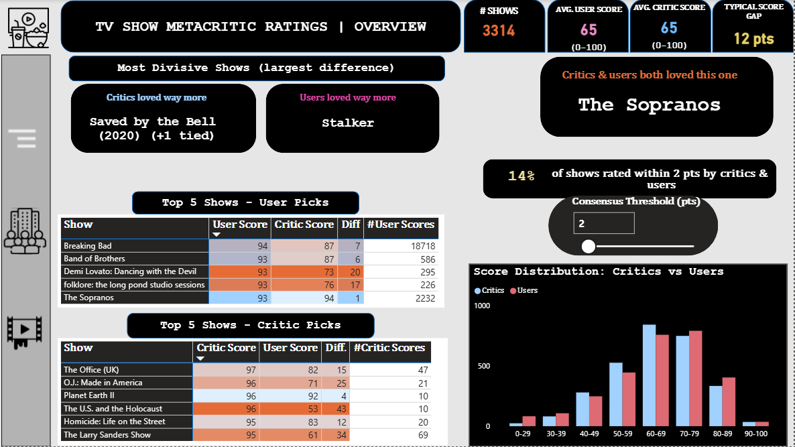
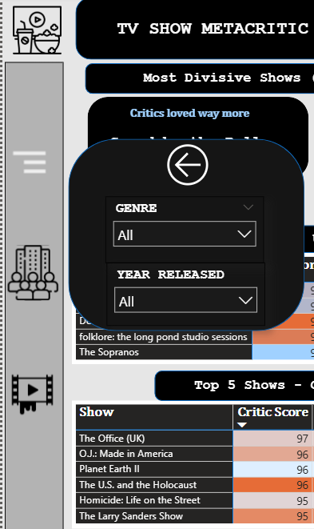
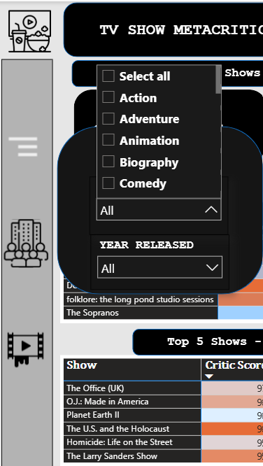
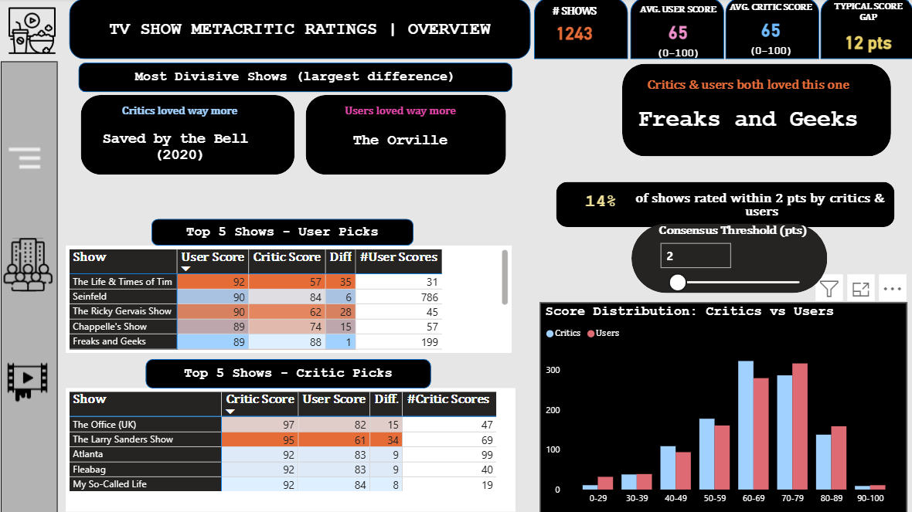
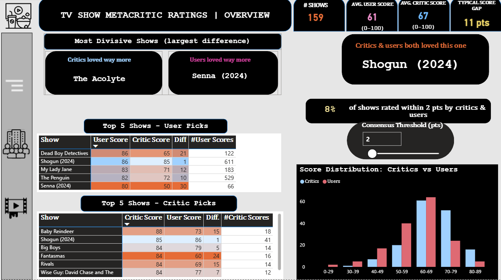
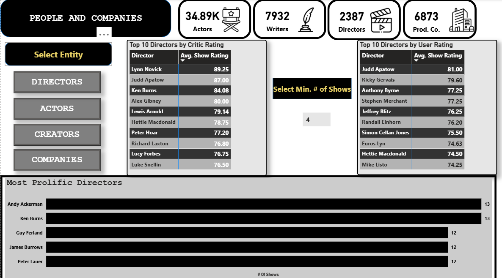
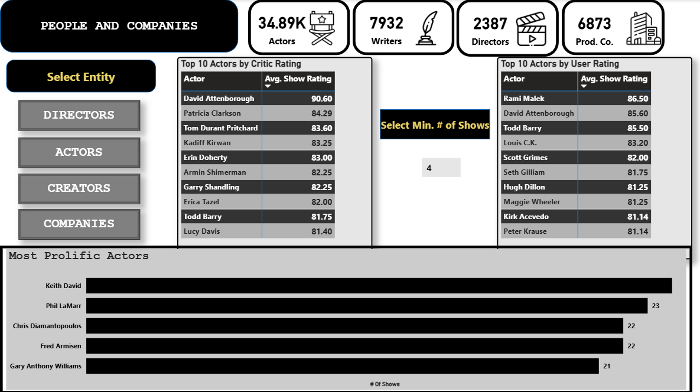

## Page 1: Overview

  

### KPI Cards
- Total Shows
- Average Metascore / Userscore (surprisingly identical)
- Typical score gap between users and critics (absolute value)

### Key Visuals

- **Insight Cards**
  - **Most Divisive Shows** : Largest rating gap between audience and critics. Critics loved "Saved by the Bell" far more than audiences; audiences loved "Stalker" far more than critics.
  - **Universal Favorite** : Where critics and users agree: "The Sopranos"

- **Top 5 Matrices** : Shows top 5 by users and by critics, with the corresponding score from the other group to highlight agreement or disagreement.

- **Consensus** : Adjustable threshold lets users explore how many shows are rated within X points by both audiences and critics (e.g., within 3 points).

- **Score Distribution** : Compares how scores are distributed for users vs critics. Both peak in the 60–69 range, showing general alignment overall.

### Slicer Panel

A slicer panel on the left enables deeper exploration by genre and release year.

  <table>
    <tr>
      <td align="center"></td>
      <td align="center"></td>
    </tr>
  </table>

#### Filtering by Genre: Comedy

Selecting **Comedy** filters all visuals to show comedy-specific insights : most divisive comedy, top 5 comedies by audience, and so on.

  

#### Filtering by Year: 2024

Similarly, selecting **2024** filters to shows released that year:

  

## Page 2: People & Companies

  

### KPI Cards

Four static cards display totals for Directors, Actors, Writers, and Production Companies.

### Entity Analysis

Users can select which entity to explore via toggle buttons. Bookmark-based navigation switches between Directors, Actors, Creators, and Companies.

**For each entity:**
- **Top Rated** — Matrix visuals show highest-rated by critics and by audience
- **Most Prolific** — Bar chart shows entities with the most shows

**Minimum Shows Threshold** — Some entities have only one show and may be a "one-hit wonder." An adjustable parameter lets users set the minimum number of shows an entity must have to appear in the ratings rankings.

By way of example, below is the view when "Actors" are selected.

  

